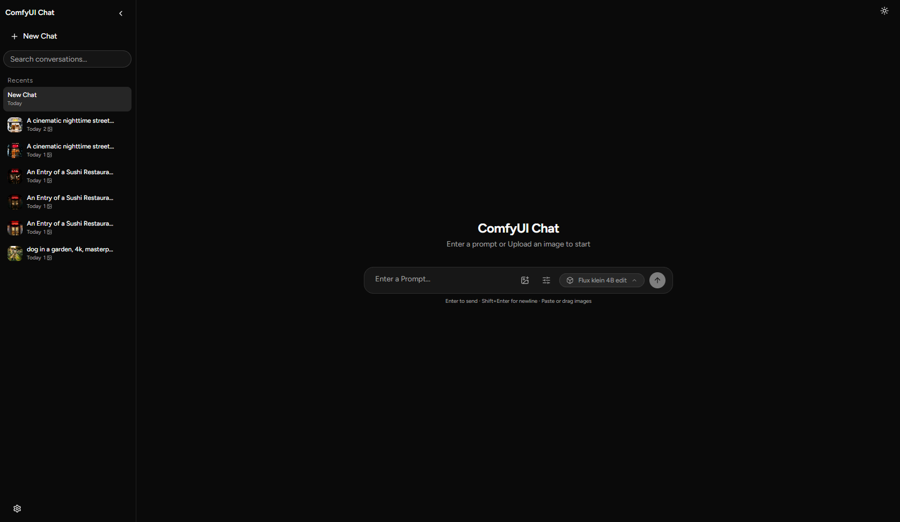
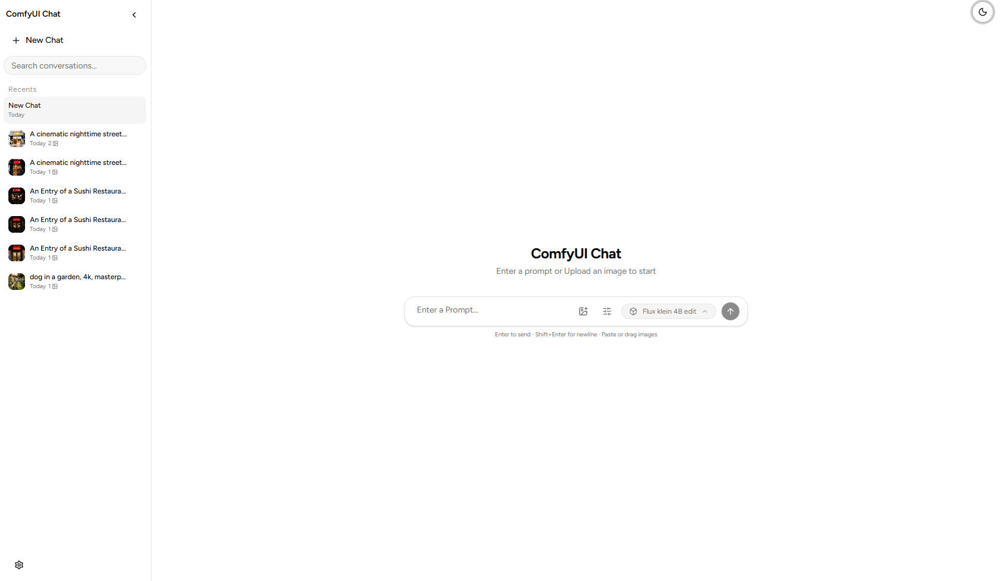
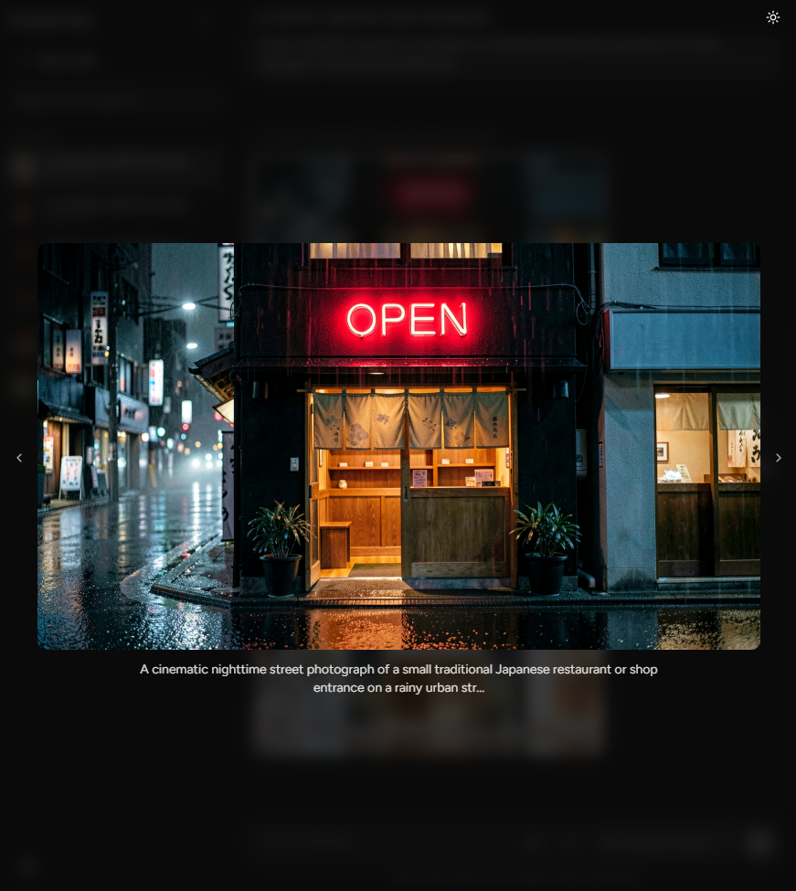
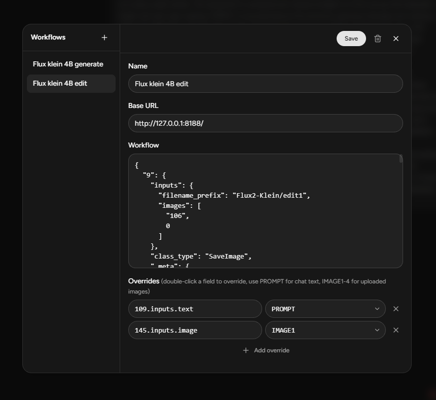

# ComfyUI Chat

A ChatGPT inspired WebUI for ComfyUI

## Features

- Run saved ComfyUI workflows from a chat interface
- Generate and edit images with text prompts
- Upload local images for image-to-image workflows
- Workflow editor with prompt and image overrides
- Multiple conversations stored locally in the browser
- Fullscreen image viewer with captions and keyboard navigation
- Light and dark themes

## Demo










## Setup

Requirements:

- [Bun](https://bun.sh/)
- A running [ComfyUI](https://github.com/comfyanonymous/ComfyUI) server

```sh
bun install
bun run dev
```

Open the local URL, add a workflow in Settings, and enter your ComfyUI server URL, for example:

```text
http://127.0.0.1:8188
```

## Build

```sh
bun run build
bun run preview
```

## Credits

- Gholamreza Dar 2026
- MiMo 2.5
- ChatGPT 5.6 Luna

## AI Usage

- Mainly AI for implementation and backend design
- Human for UI/UX design and decision making
